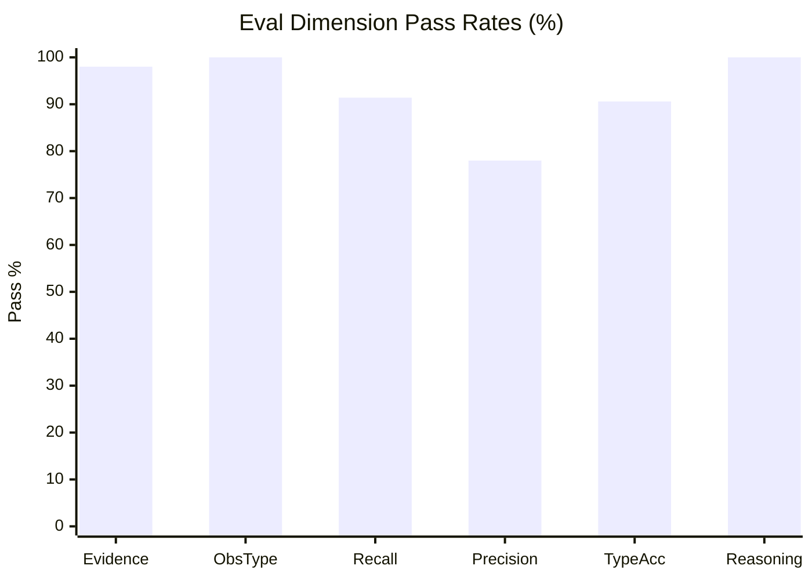
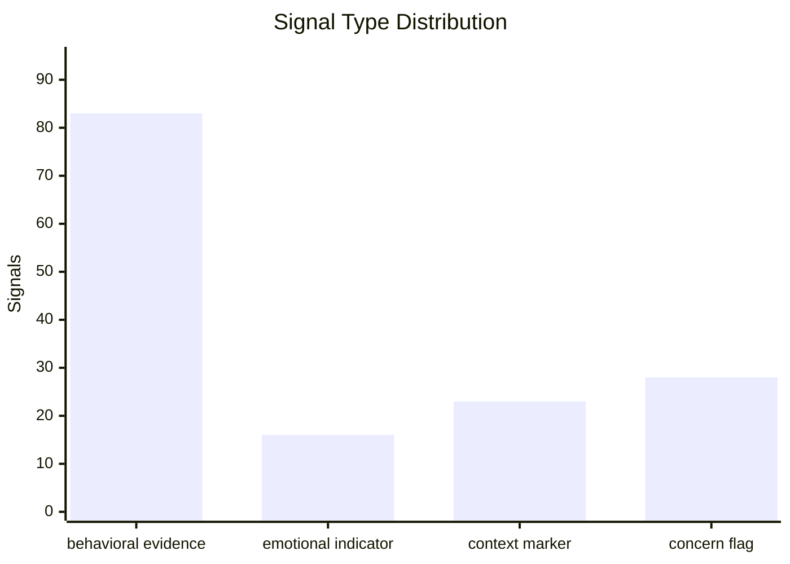
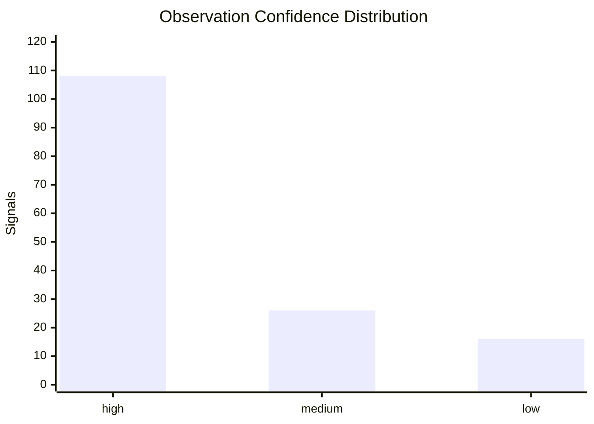
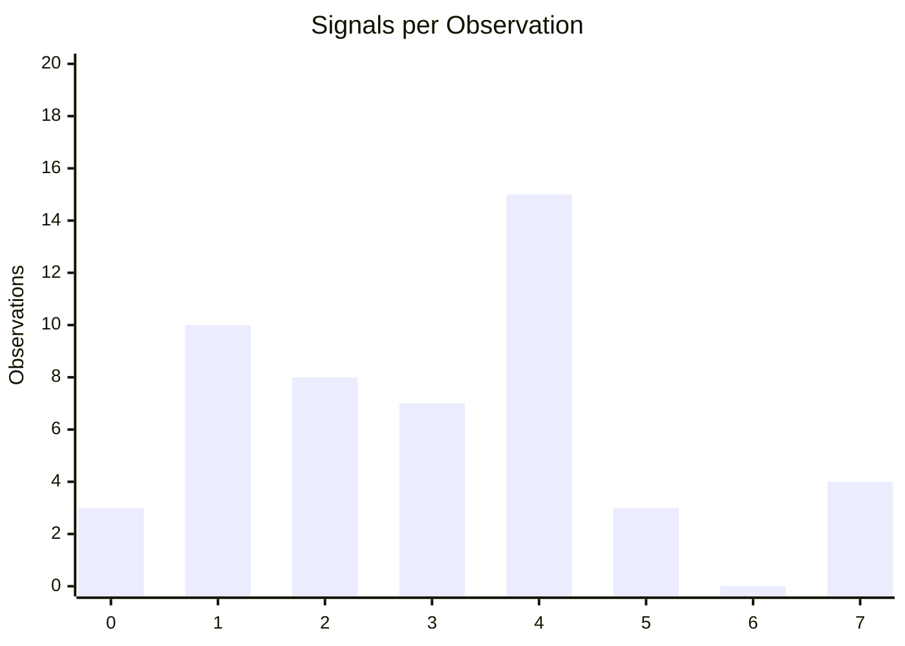
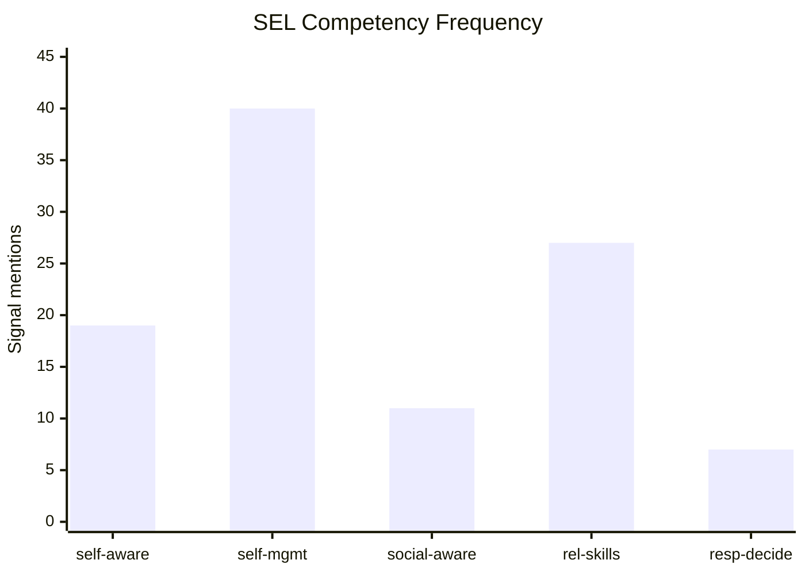

# Layer 1 Evaluation Summary

_Generated 2026-04-16 12:51 — scope: first 50 golden examples (with reasoning audit)_

**50 observations scored · 150 signals extracted · 40 individual / 10 group**

## Results

```text
Scored 50 results (50 golden annotations available)

Dimension                                    Rate   Target    Floor  Result  Detail
--------------------------------------------------------------------------------------------------------------
Evidence Grounding                          98.0%     100%      95%  WARN    147/150 signals
Observation Type                           100.0%     100%      98%  PASS    50/50 observations
Signal Completeness (recall)                91.4%      85%      75%  PASS    117/128 golden signals
No Hallucinated Signals (precision)         78.0%     100%      95%  FAIL    117/150 predicted signals
Type Accuracy                               90.6%      95%      85%  WARN    106/117 matched pairs

Golden-annotated observations scored: 50

Evidence grounding failures (first 20):
  20e745ff1cd3  'George did a great job tying the "coada vacii" knot on his own'
  5a0230aae3d8  'We played a game called "Hocus Pocus, Everybody Focus."'
  9d06e78fbb48  'They also enjoyed creating a model "nose" using condiments of their choice, thoughtfully selectin...'

Reasoning Audit (N=50 observations)
Dimension                                    Rate   Target    Floor  Result  Detail
--------------------------------------------------------------------------------------------------------------
Reasoning matches answer                   100.0%      95%      85%  PASS    150/150 signals
```

## Pass Rates



## Signal Mix





## Density



## SEL Competencies


